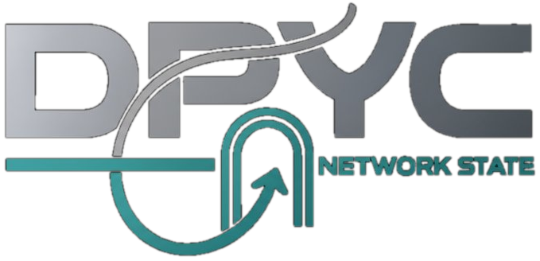

# The DPYC Creed

*A declaration of values for the Don't-Pester-Your-Customer Honor Chain.*

---

## I. Sound Money or No Deal

We transact in Bitcoin. Not tokens of convenience. Not stablecoins pegged to currencies that lose purchasing power by design. Not IOUs redeemable "when the network settles."

Twenty-one million. Fixed supply. No committee votes to inflate it. No emergency printer. No Cantillon insiders skimming purchasing power before it reaches the edges.

Every satoshi in this system was earned, not conjured. That is the foundation everything else stands on.

## II. Don't Pester Your Customer

This is the mantra. The name. The first and final law.

When a customer pays for a service, the transaction is complete. You do not ask for their name. You do not demand their papers. You do not erect payment walls, identity gates, or bureaucratic checkpoints between them and the value they paid for.

Sell true value in exchange for true sound currency. Do not care or record with whom you transacted. The customer funded their balance. The service is theirs. Get out of the way.

## III. Profit Is the Signal

We are passionate about profit. Profit is not a dirty word — it is the market's verdict that you created more value than you consumed.

Every successful transaction in the Honor Chain is proof that someone, somewhere, received something worth more to them than the sats they spent. That is not exploitation. That is civilization.

We pursue profit relentlessly. We celebrate those who achieve it. We study their methods and sharpen our own.

## IV. We Savor Wealth

Wealth is the accumulated proof of value delivered. It is the stored record of problems solved, needs met, and services rendered better than anyone else could.

We do not apologize for it. We savor it, grow it, and deploy it to create more. Wealth flows to those who offer maximal value to the benefit of common mankind. The wealthy got wealthy by serving others. We honor that.

## V. Privacy Is a Moral Obligation

A transaction is between buyer and seller. No third party has a right to that information.

We do not collect Personally Identifiable Information. We do not store it. We do not sell it. Not because regulations allow it — but because morality demands it.

Knowing your customer's identity is not your business. Delivering value is.

## VI. Prices Carry Information

Every price in a free market is a signal — a compressed message about scarcity, demand, preference, and opportunity cost. Central planning destroys these signals. Artificial credit expansion distorts them. Malinvestment follows as night follows day.

We trust markets, not committees. We trust price discovery, not administered rates. We let the entrepreneur discover value and the market reveal it.

## VII. Proof of Work, Not Proof of Authority

Membership in the Honor Chain is earned, not granted by credential. Standing is maintained through service, not through title.

Your keys, your identity. Your service, your reputation. Your customers, your revenue. No permission required to build. No gatekeeper required to serve.

The separation of money and state is not an aspiration. It is a prerequisite.

---

## The Honor Chain

These seven articles are not guidelines. They are the load-bearing walls of the DPYC Network State.

Every Operator who runs a Tollbooth, every Authority who certifies a purchase, every Citizen who funds a balance — all stand on this common ground.

We do not enforce compliance through surveillance. We enforce it through economics. Violate the creed, and the chain routes around you. Deliver value, and the chain rewards you.

This is how voluntary commerce works. This is how it has always worked. We are simply building the rails.

---

## Support the Mission

The DPYC Network State runs on conviction and commerce. If these words resonate:

**[DPYC Shop](https://stablecoin.myshopify.com)** — wear the creed, stock your shelf, fuel clear thinking.

- **DPYC Merchandise** — wear the creed
- **Books on Austrian Economics** — Mises, Rothbard, Hayek, Hazlitt — the intellectual foundation
- **Books on Bitcoin** — the technical and philosophical canon
- **Good Brew Coffee** — because clear thinking requires proper fuel
