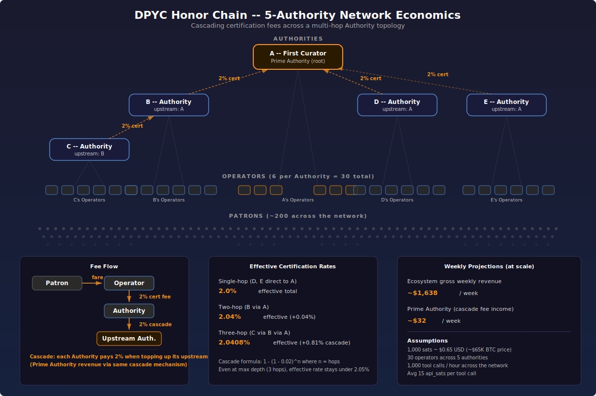

# DPYC™ Community


> **This registry:** [`github.com/lonniev/dpyc-community`](https://github.com/lonniev/dpyc-community)

**Membership registry and governance for the Don't Pester Your Customer™ Tollbooth community.**

**[Read the DPYC Creed](https://github.com/lonniev/dpyc-community/blob/main/CREED.md)** — our founding declaration of values.

## What is DPYC?

**Don't Pester Your Customer** — a philosophy for API monetization using pre-funded Bitcoin Lightning balances instead of KYC, stablecoins, or per-request payment negotiation.

Customers fund their balance once with a Lightning payment, then use API services without interruption. No credit cards. No identity verification. No payment popups mid-session. Just sats in, service out.

## Why Tollbooth?

Tollbooth DPYC™ monetizes **complete business information** — full MCP tool responses — not raw REST data fragments. A single Tollbooth-metered tool call delivers a ready-to-use answer that would otherwise require assembling dozens of individual API calls.

**Fewer round-trips, no interruptions.** Pre-funded Lightning balances mean each tool call is a single HTTP request. Protocols like [x402](https://github.com/AIM-Intelligence/x402) and [L402](https://docs.lightning.engineering/the-lightning-network/l402) take a different approach — gating individual REST endpoints with per-request payment challenges (402 → pay invoice → retry). That pattern works well for simple resource access, but adds 6+ HTTP round-trips per request and interrupts agent workflows with payment redirects.

**For AI agents:** your tool chain will never be interrupted by payment ceremonies. Fund once, call tools, get answers.

| | Tollbooth (MCP) | x402 / L402 (REST) |
|---|---|---|
| **What's metered** | Complete tool responses (business information) | Individual REST endpoints (data fragments) |
| **Round-trips per call** | 1 (pre-funded balance) | 6+ (challenge → pay → retry) |
| **Agent experience** | Seamless — no mid-session interruptions | Payment redirects between calls |
| **Identity** | Nostr npub (no KYC) | Varies by implementation |

x402 and L402 are respected approaches solving real problems in HTTP-native monetization. Tollbooth operates at a different layer — the MCP tool layer — where the unit of value is a complete answer, not a data fragment. The two even compose: when an Operator's *own* upstream API is x402-gated, the SDK **encapsulates** that handshake — the Operator absorbs the 402 ceremony as a cost of goods, and patrons keep paying in the pre-funded sats they already hold.

## The DPYC Social Contract

DPYC is a voluntary **Social Contract** among Tollbooth Operators and Authorities, organized as a **Network Society** in the [Balaji Srinivasan tradition](https://thenetworkstate.com/). Members agree to:

1. **Use BTC and Lightning** for all commerce within the ecosystem
2. **Avoid saving customer PII** — especially financial data (the DPYC philosophy)
3. **Properly identify their upstream Tollbooth Authority** via their Nostr npub
4. **Honor their Authority's fee schedule** as the cost of participating in the network
5. **Accept community governance** including member banning for violations

### Actors

The ecosystem has a handful of actor roles. Three are formal protocols in the [tollbooth-dpyc](https://github.com/lonniev/tollbooth-dpyc) SDK — `OperatorProtocol`, `AuthorityProtocol`, `OracleProtocol`:

- **Operators** run Tollbooth-metered MCP services and collect Lightning fares.
- **Authorities** certify Operators and collect a small ad valorem fee on every purchase order. They provision each Operator's isolated database tenant and sign the certificates that prove a fare was paid.
- **Oracles** are free, unauthenticated concierges that answer questions about membership, governance, onboarding, and tax rates by reading this registry.

Two further roles round out the community:

- **Advocates** are shared community utilities — an OAuth2 callback mailbox, a URL shortener, and the like — infrastructure the whole network leans on.
- **Citizens** are the patrons: anyone holding a Nostr keypair who pre-funds a balance and consumes services. Citizenship asks just for that keypair and some sats; the registry records the actor roles above — Operators, Authorities, and Advocates.

## How It Works

### Identity & proof

**Identity** is a [Nostr](https://nostr.com/) keypair. Your `npub` is your member ID everywhere in the ecosystem — no email, no username, no government ID.

When a tool call needs to bind a request to its owner, the patron proves control of the npub in one of two ways:

- **Inline Schnorr proof** — a signed Nostr event (kind 27235) carrying the tool name, valid for a short freshness window.
- **Poison-keyed proof token** — a short, human-readable phrase (e.g., `keen-eagle-58`) issued during a one-time DM **challenge on a pinned rendezvous relay**. The patron's app remembers the phrase and replays it on later calls; the Operator stores just a salted hash, scoped against replay.

### Credentials (Secure Courier)

When an Operator or patron must hand over secrets (API keys, OAuth tokens), they travel by **Secure Courier** — a poison-scoped, NIP-encrypted Nostr DM flow pinned to a rendezvous relay. A welcome DM carries a session phrase; that matching phrase unlocks the credential reply, keeping the channel bound to its intended recipient. Returning patrons activate instantly from their encrypted vault (**vault-first recovery**). Credentials can also be packaged as scannable **credential cards** (`ncred1…` bech32 events) for QR delivery.

### Credits & pricing

Funds are held as **tranches** — discrete allocations consumed oldest-first, each with an optional expiry (**TrancheLifetime**). Every metered call passes through the SDK's money gate, `debit_or_deny`, which resolves identity, checks any proof requirement, evaluates the Operator's pricing constraints, computes the cost, and debits the ledger in one atomic step — returning either the price in api-sats or a clear explanation. Operators shape price and access through composable [pricing constraints](#pricing-constraints), edited live and applied at once.

### Certification & the chain

When a patron buys credits, the Operator's runtime asks its **Authority** to certify the purchase. The Authority deducts an **ad valorem fee** (configurable per Authority; default 2%, minimum 10 sats) from the Operator's pre-funded reserve and returns a **Schnorr-signed Nostr event certificate** proving the fare was paid before it was collected. Authorities can themselves answer to higher Authorities, so the fee cascades up the chain.

### Tenancy

Each certified Operator gets its **own isolated Neon Postgres schema** with a dedicated database role, provisioned by its Authority. Operators own and encrypt their own data; no Operator can read another's vault.

### The registry

Membership is stored as individual JSON files under [`members/`](https://github.com/lonniev/dpyc-community/tree/main/members), organized by role:

```
members/
  prime/              # First Curator (Prime Authority) — single record
  authorities/        # Authorities
  operators/          # Operators
  advocates/          # Advocates (community utility services)
  persona-non-grata/  # Banned members
  read-only-lookup-cache.json  # Generated index — do not edit
```

Each file is named `{npub}.json` and holds the member record for an Operator, Authority, or Advocate. Citizenship stays free and unregistered — a keypair and a balance are enough. The [`read-only-lookup-cache.json`](https://github.com/lonniev/dpyc-community/blob/main/members/read-only-lookup-cache.json) index is a generated artifact auto-rebuilt by CI from the individual files; downstream consumers (like the Oracle) use it for fast lookup. When a Tollbooth Authority certifies a purchase, it checks this registry to verify the Operator's `npub` is active.

### Governance

**Governance** uses GitHub's native tools — PRs for membership changes, Issues for ban proposals, branch protection for integrity. Git's Merkle tree provides a tamper-evident audit trail.

### The Certification Chain

The certification chain is a franchise tree rooted at the First Curator. The structure below is illustrative — the live shape (which today runs a multi-region, three-deep authority chain) is recorded in [`members/`](https://github.com/lonniev/dpyc-community/tree/main/members):

```
First Curator (Prime Authority)
  │   mints the initial cert-sat supply; root of trust
  │
  ├── Operator ............... runs a Tollbooth-metered MCP service
  ├── Advocate ............... shared community utility (not metered)
  │
  └── Regional Authority ..... certifies Operators in its domain
        ├── Operator
        ├── Operator
        └── Sub-Authority .... a deeper certification tier
              └── Operator
```

Value flows from **actual API consumption at the edges**, not from recruitment. Each Authority charges a certification fee from its Operators, motivating them to vet onboarding, police downstream, and maintain standing. This is a **franchise model**, not MLM.

## How to Join

**Citizenship is voluntary and asks for no personal information** — to use DPYC services, just generate a Nostr keypair, pre-fund a balance at any Operator, and start calling tools. **Operators, Authorities, and Advocates** register to promote their location and their service; the steps below walk through that.

1. **Generate a Nostr keypair** — use any Nostr client, or:
   ```bash
   pip install nostr-sdk
   python -c "from nostr_sdk import Keys; k = Keys.generate(); print(f'npub: {k.public_key().to_bech32()}'); print(f'nsec: {k.secret_key().to_bech32()}')"
   ```

2. **Find a sponsoring Authority** — an existing Authority in the network who will vouch for you.

3. **Your Authority submits a PR** adding a file `members/{role}/{npub}.json` with your role, services, and their npub as your `upstream_authority_npub`. **Advocates** (shared community utilities) register directly via the Oracle's `register_advocate` tool.

4. **PR reviewed and merged** — the CI workflow validates individual member files and auto-regenerates `members/read-only-lookup-cache.json`.

## How Banning Works

1. **Issue opened** on this repo with evidence of the violation
2. **Community discussion** — 72-hour period for Authorities to weigh in
3. **PR submitted** changing the member's `status` to `"banned"` with a `ban_reason` linking the Issue
4. **Banned members** retain their record (transparency) but can no longer transact within the community
5. **Appeals** via new Issue referencing the original ban — community review, restore PR if upheld

See [GOVERNANCE.md](https://github.com/lonniev/dpyc-community/blob/main/GOVERNANCE.md) for the full governance process.

## Related Repositories

**Registry & concierge**

| Repository | Purpose |
|-----------|---------|
| **[dpyc-community](https://github.com/lonniev/dpyc-community)** | **This repo — community registry and governance** |
| [dpyc-oracle](https://github.com/lonniev/dpyc-oracle) | Free community concierge MCP — membership, governance, onboarding, tax rates |

**SDK & Authorities**

| Repository | Purpose |
|-----------|---------|
| [tollbooth-dpyc](https://github.com/lonniev/tollbooth-dpyc) | The shared Python SDK — all crypto, vault, proof, pricing, courier, and runtime bootstrap |
| [tollbooth-authority](https://github.com/lonniev/tollbooth-authority) | Prime Authority — certification and fee collection |
| [tollbooth-authority-northamerica](https://github.com/lonniev/tollbooth-authority-northamerica) | Regional Authority (North America) |
| [tollbooth-authority-newengland](https://github.com/lonniev/tollbooth-authority-newengland) | Sub-regional Authority (New England) |

**Operators**

| Repository | Purpose |
|-----------|---------|
| [thebrain-mcp](https://github.com/lonniev/thebrain-mcp) | TheBrain personal knowledge-graph MCP — the first Tollbooth Operator |
| [schwab-mcp](https://github.com/lonniev/schwab-mcp) | Charles Schwab brokerage data MCP with OAuth2 patron auth |
| [excalibur-mcp](https://github.com/lonniev/excalibur-mcp) | X (Twitter) posting MCP with Secure Courier credential delivery |
| [cypher-mcp](https://github.com/lonniev/cypher-mcp) | Monetized graph answers — named Cypher templates over Neo4j/AuraDB |
| [taxsort-mcp](https://github.com/lonniev/taxsort-mcp) | Tax-transaction classification MCP with a hosted frontend |
| [optionality-mcp](https://github.com/lonniev/optionality-mcp) | AI-judged options-trading practice MCP |
| [tollbooth-sample](https://github.com/lonniev/tollbooth-sample) | Reference Operator — the canonical template for new servers |

**Advocates (community utilities)**

| Repository | Purpose |
|-----------|---------|
| [tollbooth-oauth2-collector](https://github.com/lonniev/tollbooth-oauth2-collector) | Shared OAuth2 authorization-code mailbox |
| [tollbooth-shortlinks](https://github.com/lonniev/tollbooth-shortlinks) | Ephemeral, Nostr-friendly short URLs for OAuth flows |

**Apps & sites**

| Repository | Purpose |
|-----------|---------|
| [tollbooth-pricing-studio](https://github.com/lonniev/tollbooth-pricing-studio) | Operator workbench (iPadOS) — live pricing editor, constraint pipeline, AI pricing campaigns |
| [tollbooth-dpyc-site](https://github.com/lonniev/tollbooth-dpyc-site) | Marketing site, live at [tollbooth-dpyc.com](https://tollbooth-dpyc.com) |
| [network-states-of-the-internet](https://github.com/lonniev/network-states-of-the-internet) | Reference material — a dashboard of startup societies |

## Built On

- [Nostr](https://nostr.com/) — decentralized identity and social protocol
- [Bitcoin / Lightning Network](https://lightning.network/) — payments
- [BTCPay Server](https://btcpayserver.org/) — self-hosted payment processing
- [Model Context Protocol (MCP)](https://modelcontextprotocol.io/) — AI tool interoperability
- [Neon Postgres](https://neon.tech/) — per-Operator encrypted tenant storage
- [GitHub](https://github.com/) — governance and tamper-evident registry

## Platform Capabilities

The [tollbooth-dpyc](https://github.com/lonniev/tollbooth-dpyc) SDK owns every shared concern — Operators consume it via import, and crypto, vaulting, proof, pricing, and certification all live in the SDK. Current capabilities include:

- **Two-tactic identity proof** — inline Schnorr (kind 27235) or a poison-keyed token issued over a rendezvous-relay challenge.
- **Secure Courier credential delivery** — poison-scoped, relay-pinned, NIP-encrypted DMs with vault-first recovery and `ncred1…` credential cards.
- **Tranche-based credit lifecycle** — oldest-first consumption with optional per-allocation expiry (TrancheLifetime).
- **Composable pricing constraints** — a constraint engine Operators edit live (see below).
- **Cascading ad valorem certification** — Schnorr-signed certificates up a multi-tier Authority chain.
- **Per-Operator schema isolation** — each Operator gets its own encrypted Neon tenant and database role.
- **Transparent x402 upstream encapsulation** — Operators consume x402-gated APIs without exposing the 402 ceremony to patrons.
- **Nostr audit trail & OpenTimestamps** — encrypted, notarized records of ledger activity.

> **Versions live in one place** — [`network-status.json`](https://github.com/lonniev/dpyc-community/blob/main/network-status.json) tracks the live component versions and the current security floor, refreshed as the fleet advances.

### Pricing Constraints

Operators shape price and access by composing constraints, edited live and applied at once (e.g., from the [Pricing Studio](https://github.com/lonniev/tollbooth-pricing-studio) app):

| Constraint | What it does |
|---|---|
| **Free Trial** | First N invocations per patron are free |
| **Happy Hour** | Time-windowed discount with optional weekly/monthly/annual recurrence |
| **Surge Pricing** | Demand-elastic multipliers (busier = more, or run it in reverse for volume discounts) |
| **Finite Supply** | Cap total invocations, globally or per patron |
| **Periodic Refresh** | Rate-limit to N calls per rolling time window |
| **Coupon** | Apply operator-minted coupon discounts |
| **Loyalty Discount** | Percentage off after a patron crosses a spend threshold |
| **Bulk Bonus** | Tiered bonus value based on lifetime consumption |
| **Patron Proof** | Require a fresh npub proof as a friction gate on high-value tools |
| **Temporal Window** | Restrict access by time-of-day / day-of-week in a given timezone |
| **JSON Expression** | Custom boolean access logic via a safe (no-eval) expression tree |

## Economic Model



The network uses a cascading certification fee model. Each Authority collects an ad valorem fee (configurable per Authority; default 2%) when certifying Operator purchase orders. Multi-hop chains (C→B→A) create a small cascade effect, keeping the total effective rate low even at maximum depth.

[DPYP-01: Base Certificate Protocol](https://github.com/lonniev/dpyc-community/blob/main/protocols/dpyp-01-base-certificate.md) — the canonical specification for DPYC credit certificates.

## Further Reading

- [Tollbooth Whitepaper](docs/WHITEPAPER.md) — full technical architecture, economic model, and the DPYC Social Contract
- [Threat Model](docs/THREAT-MODEL.md) — security posture, trust boundaries, and mitigations
- [Competitive Landscape](docs/COMPETITIVE-LANDSCAPE.md) — how Tollbooth compares to L402, x402, MCPize, and other approaches
- [How to Add an Authority](docs/how-to-add-authority.md) — onboarding a new certifying Authority to the chain
- [OpenTimestamps Dashboard](docs/ots-dashboard.html) — notarization status for registry audit events
- [The Phantom Tollbooth on the Lightning Turnpike](https://stablecoin.myshopify.com/blogs/our-value/the-phantom-tollbooth-on-the-lightning-turnpike) — the full story of how we're monetizing the monetization of AI APIs

## Patent & Trademarks

**Patent Pending** — US Provisional Application 64/045,999

The filing documents are published in [`docs/patent/`](docs/patent/):

- [Cover Memo](docs/patent/COVER-MEMO.md)
- [Provisional Specification (draft)](docs/patent/PROVISIONAL-SPEC-DRAFT.md)
- [Patent Figures](docs/patent/PATENT-FIGURES-ALL.pdf) · [Reference Numeral Schedule](docs/patent/REFERENCE-NUMERAL-SCHEDULE.md)
- Prior-art search: [Patent](docs/patent/PRIOR-ART-PATENT-SEARCH.md) · [Non-Patent](docs/patent/PRIOR-ART-NON-PATENT-SEARCH.md)
- [Complete filing package (PDF)](docs/patent/FILING-PACKAGE.pdf)

DPYC, Tollbooth DPYC, and Don't Pester Your Customer are trademarks of Lonnie VanZandt. See [TRADEMARKS.md](TRADEMARKS.md) for usage guidelines.

## License

Apache License 2.0 — see [LICENSE](https://github.com/lonniev/dpyc-community/blob/main/LICENSE) for details.
