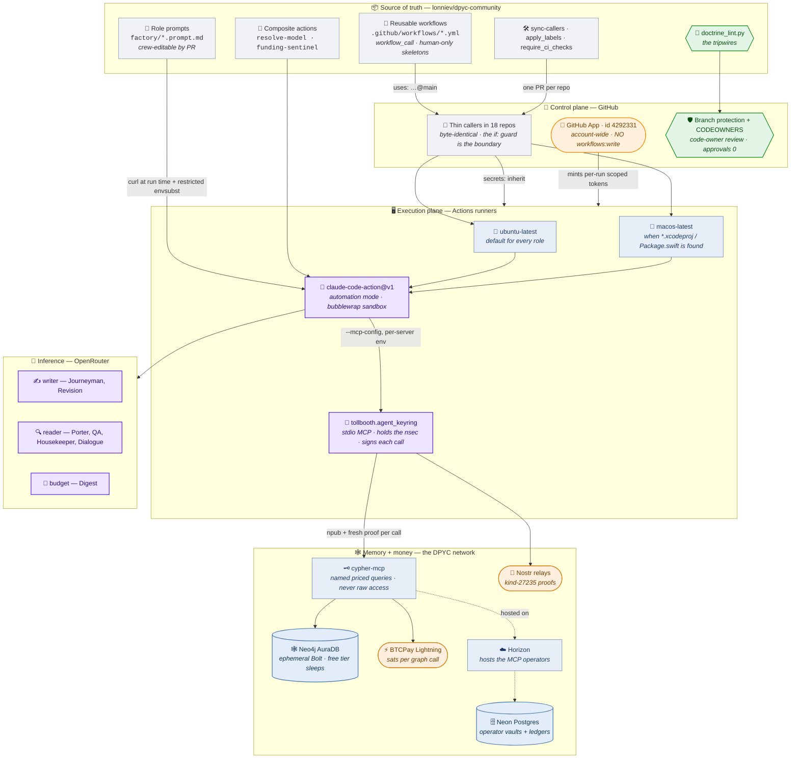
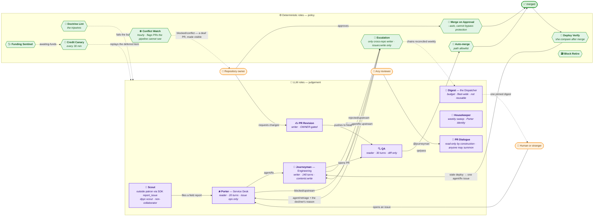
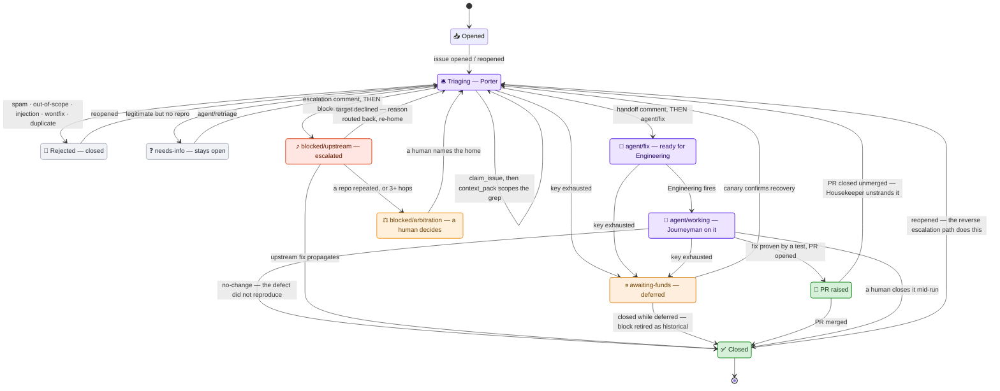
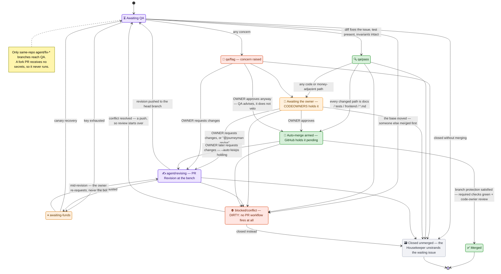
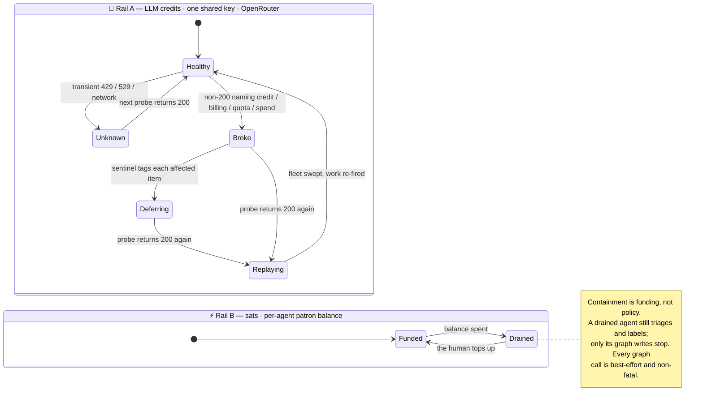
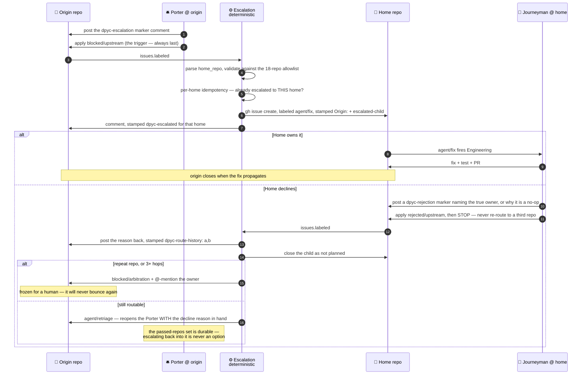

# The DPYC™ Software Factory — rendered views

Mermaid renderings of the model in [`dpyc-factory.sysml`](./dpyc-factory.sysml). GitHub
renders these inline; so does any Markdown viewer with Mermaid support.

Every element traces to source in this repository — see the
[element → file map](./README.md#provenance--element--source-map).

---

## 1. Tech stack

The Factory spans four planes. Only the control plane is GitHub; the memory and money
planes are the DPYC network itself, which is why an agent's graph write is a paid,
signed, patron-authenticated call rather than a database connection.

**Stack facts worth keeping in view.** Python 3.12 is canonical fleet-wide, with the SDK
alone on a 3.12/3.13 matrix, which it gates behind a single `test` aggregate. A required-check
context avoids a version suffix — every repo posts `test`, not `test (3.12)` — because a name pinned
to a matrix cell orphans the moment the matrix moves; required checks are set per repo from that
repo's *actual* posted contexts, since a guessed name jams merges forever. `ANTHROPIC_API_KEY` is a name that outlived its provider: it carries the
OpenRouter key, whose Anthropic-compatible endpoint reads the same `x-api-key` header, so
the cutover changed one secret value instead of ~96 call sites.

---

## 2. The crew, and who is allowed to fire it

Judgement gets an agent; policy gets bash. Every gate that could land code is on the
deterministic side of this line, which is what makes the pipeline immune to both prompt
injection *and* a dry key at exactly the moments that matter.

---

## 3. Issue lifecycle

The Porter takes **exactly one** routing action, which is why these branches are
exclusive. Note the ordering constraint that shows up twice: the machine-readable comment
is posted *first*, the label *last*, because the label is the trigger and a deterministic
workflow will read the comments the moment it fires.

---

## 4. Pull request lifecycle

One state here is unlike the others. **`blocked/conflict` is not blocked, it is deaf**:
GitHub dispatches no PR workflow runs at all while a pull request conflicts with its base,
so QA, auto-merge and Merge on Approval never hear about it. An owner can approve and watch
nothing happen, with no failing check to explain the silence. A PR enters it without doing
anything — someone else merged first — which is why the hourly Conflict Watch sweep exists
to notice and say so.

Two merge paths, both deterministic, neither able to bypass branch protection. The
"Merge Oops" question answers itself here: `--auto` never lands on a red required check —
it *holds* until the gates go green, so a bad merge is not a risk this design mitigates,
it is one the design cannot express.

---

## 5. Funding — two independent rails

The crew spends on two rails that fail independently, and the design leans on that. LLM
credits buy inference; **sats** buy graph writes. When the inference rail is dry, the sats
rail still works — which is exactly how "what is currently awaiting funds" stays queryable
while every LLM node is dark.

**Outage detection is a signature, not a guess.** A dry key makes the action fail on turn 1
with `is_error:true`, `num_turns <= 1`, `total_cost_usd == 0` — rejected before any work,
billed nothing. That exact shape is the *only* thing tagged `awaiting-funds`; a genuine
agent failure shows real turns, real cost, and usually permission denials, so it is never
mislabeled and quietly retried forever.

**Replay is discriminated by what the item already carries**, because the labels record
which node the outage cut:

| Item | Carries | Node that was skipped | Recovery action |
|---|---|---|---|
| Issue | no `agent/fix` | Porter | add `agent/retriage` |
| Issue | `agent/fix` | Engineering | re-toggle `agent/fix` |
| PR | no `agent/revising` | QA | add `agent/retriage` |
| PR | `agent/revising` | PR Revision | **comment only** — the owner must re-request |

That last row is a deliberate refusal. PR Revision is gated on a human owner review, and
letting the bot re-trigger a write-capable role would dissolve exactly the boundary that
gate exists to hold.

---

## 6. Escalation and the anti-ping-pong loop

Escalation is the only workflow that writes across repositories, and it holds the only
account-wide token — downscoped to `issues: write` and nothing else. Widened scope is
always paired with narrowed permission.

The markers named below are HTML comments in the issue thread — `<!-- dpyc-escalation -->`,
`<!-- dpyc-rejection -->`, `<!-- dpyc-route-history: a,b -->` — written out in full in
§Items of the model. They are named rather than quoted here because a literal `--` inside a
Mermaid sequence message is lexed as the start of an arrow token and breaks the diagram.

The subtle bug this shape had to fix: idempotency was originally *unscoped* — any
"already escalated" marker stopped further routing. That meant an issue declined by its
first home could never be re-homed. Idempotency is now **per home**, so each home is
escalated at most once while a re-home stays possible.

---

## 7. Guard map — who can change what

Most of these are enforced by something in this repository — a linter rule, a token scope, a
caller expression — so reading the code tells you whether they hold. **G3 is the exception:
branch protection is live server-side state that no file here controls.** It was documented as
holding fleet-wide while six repos had no gate at all. Where a guard's mechanism is
configuration rather than code, the table says when it was last verified, not that it is
currently true.

| # | Guard | Enforced by | Mechanism, not a promise |
|---|---|---|---|
| G1 | An agent cannot change the powers it is granted | GitHub App scope + `doctrine_lint` | The App holds no `workflows: write`, so the token *cannot* push a `.github/workflows/` edit; the linter fails red if a diff adds the permission |
| G2 | No self-merge, no self-approval | `doctrine_lint` on `--allowedTools` | Bans `gh pr review`, `Bash(gh:*)`, `Bash(gh pr:*)`, bare and `--admin` `gh pr merge`; permits only the gated `gh pr merge --auto` |
| G3 | Money paths need a human | CODEOWNERS + branch protection | `* @lonniev` catch-all with `require_code_owner_reviews`; approvals set to 0 so docs still auto-land; `enforce_admins` false keeps the owner's escape hatch. **Live server-side config, not code — it drifts.** An audit on 2026-07-29 found six repos with no gate at all; all 19 corrected, and `require_ci_checks.py` now *sets* the profile rather than preserving what it finds. Nothing schedules that audit, so read a green G3 as "true when someone last ran it" |
| G4 | Fork PRs get no secrets | `pull_request` only, banned `pull_request_target` | The trigger is banned outright rather than guarded by an `if`, because a blanket ban is auditable |
| G5 | Write-capable + human-triggered ⇒ owner-only | Caller `if:` expression | PR Revision requires `author_association == 'OWNER'`; PR Dialogue pays for open access by having no write tools and `contents: read` tokens |
| G6 | Cross-repo writes are issues-only | Token permission + allowlist | Account-wide token downscoped to `permission-issues: write`; `home_repo` word-boundary-matched against 18 repos before any write |
| G7 | No issue ping-pong | Escalation reverse path | Durable `passed_repos` set; a repeat repo or 3 hops freezes the issue as `blocked/arbitration` |
| G8 | Untrusted input is always data | Prompt anchors + `--allowedTools` | No `curl`, `bash -c`, `eval` or `rm`; every `gh` subcommand enumerated; the agent holds no secrets; an injection *attempt* is itself grounds to close |
| G9 | Secrets never enter the agent shell | `--mcp-config` per-server env; git auth header | The nsec lives only in the keyring subprocess; Dialogue's investigation token is a git header, never an env var |
| G10 | Provenance cannot be forged | cypher-mcp write template | `llm-inferred-unverified` is a Cypher **literal**, not a parameter — there is no argument that claims human authority |
| G11 | Prompts keep their safety anchors | `doctrine_lint` | `SECURITY` + `UNTRUSTED` everywhere, plus `MANDATORY OUTCOME` for Porter and PR Revision |
| G12 | Containment is funding | Per-agent patron balance | Fund the Porter thin, the Journeyman thicker; a drained agent degrades, it does not stall the pipeline |
| G13 | An outage defers, it does not fail | Funding sentinel signature | Only `is_error && turns ≤ 1 && cost == 0` counts as an outage |
| G15 | One run per role per work-item | GitHub `concurrency` group | Group is (role, repo, item number). Two Journeymen would branch the same `agent/fix-<n>` and race pushes; the canary's `agent/fix` re-toggle is the likeliest trigger. Only QA cancels in flight — it would otherwise stamp a verdict on a head that a new push replaced |
| G14 | Judgement gets an agent, policy gets bash | Role roster | Every merge, escalation, lint and verify gate is LLM-free, and therefore immune to injection and to a dry key |
